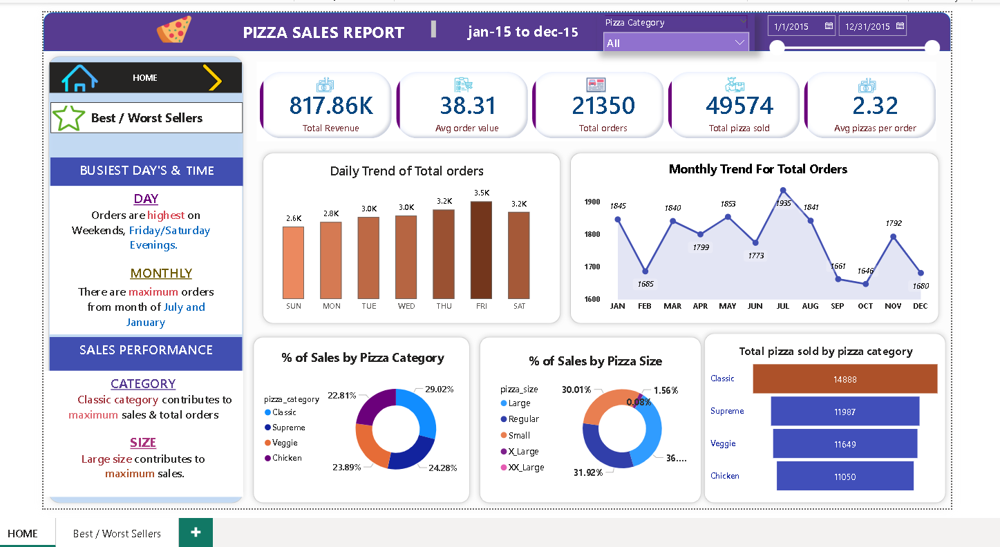
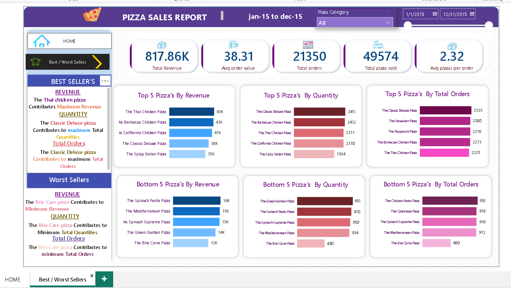

# 🍕 Pizza Sales Analysis Dashboard

## 📊 Project Overview

This project presents an interactive **Pizza Sales Analysis Dashboard** built using **Microsoft Power BI** to analyze sales performance, order trends, product performance, and customer ordering patterns.

The dashboard transforms raw pizza sales data into meaningful business insights through **data cleaning, transformation, KPI analysis, trend analysis, and interactive visualizations**.

The primary objective of this project is to identify:
- Overall sales and order performance
- Best and worst performing pizza products
- Daily and monthly order trends
- Sales contribution by pizza category
- Sales contribution by pizza size
- Product-level performance based on revenue, quantity, and orders


## 🎯 Business Objectives

The analysis focuses on answering key business questions such as:

- What is the total revenue generated?
- What is the average order value?
- How many total orders were placed?
- How many pizzas were sold?
- Which pizzas generate the highest revenue?
- Which pizzas have the highest order quantities?
- Which pizzas receive the highest number of orders?
- Which products are underperforming?
- Which days and months generate the highest number of orders?
- Which pizza category contributes the most to sales?
- Which pizza size contributes the most to sales?


## 🛠️ Tools & Technologies

- **Microsoft Power BI** – Dashboard development and data visualization
- **Power Query** – Data cleaning and transformation
- **DAX** – Measures and KPI calculations
- **Data Analysis** – Trend, category, size, and product-level analysis


## 📌 Key KPIs

The dashboard provides the following major performance indicators:

| KPI | Value |
|---|---:|
| Total Revenue | 817.86K |
| Average Order Value | 38.31 |
| Total Orders | 21,350 |
| Total Pizzas Sold | 49,574 |
| Average Pizzas per Order | 2.32 |


## 📈 Dashboard Analysis

### 1. Overall Sales Performance

The dashboard provides a high-level overview of pizza sales performance using key KPIs such as total revenue, average order value, total orders, total pizzas sold, and average pizzas per order.

### 2. Daily Order Trends

The daily trend analysis shows variations in order volume across the week.

The analysis indicates that **Friday records the highest number of orders**, followed by Thursday and Saturday, highlighting stronger customer demand toward the end of the week.

### 3. Monthly Order Trends

The monthly trend analysis shows fluctuations in order volume throughout the year.

**July records the highest number of orders**, while September and October show relatively lower order volumes.

This can help businesses plan inventory, staffing, and promotional campaigns around demand patterns.

### 4. Pizza Category Analysis

Sales contribution is analyzed across different pizza categories:

- Classic
- Supreme
- Veggie
- Chicken

The **Classic category contributes the highest share of sales**, making it an important category for overall business performance.

### 5. Pizza Size Analysis

The dashboard compares sales contribution across different pizza sizes.

The analysis shows that **Large pizzas contribute the highest share of sales**, indicating strong customer preference for larger-sized pizzas.

### 6. Best-Selling Pizzas

The dashboard identifies the top-performing pizzas based on:

- Revenue
- Quantity sold
- Total orders

The **Thai Chicken Pizza** performs strongly in terms of revenue, while **The Classic Deluxe Pizza** leads in total quantity and total orders.

### 7. Worst-Selling Pizzas

The dashboard also identifies underperforming products.

**The Brie Carre Pizza** appears among the lowest-performing pizzas across revenue, quantity, and total orders.

These insights can help management evaluate product performance and consider pricing, promotions, menu positioning, or product strategy.


## 💡 Key Business Insights

Based on the analysis:

- Total revenue generated is approximately **817.86K**.
- The business received **21,350 orders**.
- A total of **49,574 pizzas** were sold.
- Customers purchase an average of **2.32 pizzas per order**.
- **Friday** has the highest order volume among the days analyzed.
- **July** records the highest monthly order volume.
- The **Classic pizza category** contributes the highest share of sales.
- **Large pizzas** contribute the highest share of sales by size.
- **Thai Chicken Pizza** is among the strongest performers by revenue.
- **Classic Deluxe Pizza** performs strongly in terms of quantity and total orders.
- **Brie Carre Pizza** is consistently among the weakest-performing products.


## 📊 Dashboard Features

The Power BI dashboard includes:

- Interactive date filters
- Pizza category filtering
- KPI cards
- Daily order trend analysis
- Monthly order trend analysis
- Category-wise sales analysis
- Size-wise sales analysis
- Top 5 pizza analysis
- Bottom 5 pizza analysis
- Revenue, quantity, and order-based product analysis
- Interactive navigation between dashboard pages


## 📷 Dashboard Preview

### Home Dashboard



### Best / Worst Sellers Dashboard




## 📁 Project Structure

```text
Pizza-Sales-Analysis/
│
├── README.md
├── Pizza_Sales_Dashboard.pbix
├── Home_page.png
└── Best__Worst_page.png
